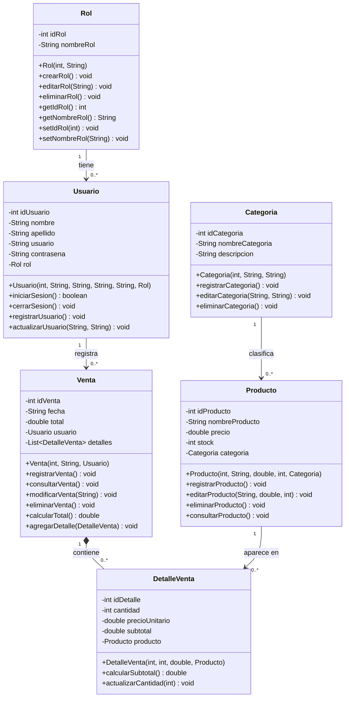

# Diagrama de clases UML - Heladería Rosa Pastel

```mermaid
classDiagram

class Rol {
  -int idRol
  -String nombreRol
  +Rol(int, String)
  +crearRol() void
  +editarRol(String) void
  +eliminarRol() void
  +getIdRol() int
  +getNombreRol() String
  +setIdRol(int) void
  +setNombreRol(String) void
}

class Usuario {
  -int idUsuario
  -String nombre
  -String apellido
  -String usuario
  -String contrasena
  -Rol rol
  +Usuario(int, String, String, String, String, Rol)
  +iniciarSesion() boolean
  +cerrarSesion() void
  +registrarUsuario() void
  +actualizarUsuario(String, String) void
}

class Categoria {
  -int idCategoria
  -String nombreCategoria
  -String descripcion
  +Categoria(int, String, String)
  +registrarCategoria() void
  +editarCategoria(String, String) void
  +eliminarCategoria() void
}

class Producto {
  -int idProducto
  -String nombreProducto
  -double precio
  -int stock
  -Categoria categoria
  +Producto(int, String, double, int, Categoria)
  +registrarProducto() void
  +editarProducto(String, double, int) void
  +eliminarProducto() void
  +consultarProducto() void
}

class Venta {
  -int idVenta
  -String fecha
  -double total
  -Usuario usuario
  -List~DetalleVenta~ detalles
  +Venta(int, String, Usuario)
  +registrarVenta() void
  +consultarVenta() void
  +modificarVenta(String) void
  +eliminarVenta() void
  +calcularTotal() double
  +agregarDetalle(DetalleVenta) void
}

class DetalleVenta {
  -int idDetalle
  -int cantidad
  -double precioUnitario
  -double subtotal
  -Producto producto
  +DetalleVenta(int, int, double, Producto)
  +calcularSubtotal() double
  +actualizarCantidad(int) void
}

Rol "1" --> "0..*" Usuario : tiene
Categoria "1" --> "0..*" Producto : clasifica
Usuario "1" --> "0..*" Venta : registra
Venta "1" *-- "0..*" DetalleVenta : contiene
Producto "1" --> "0..*" DetalleVenta : aparece en
```
